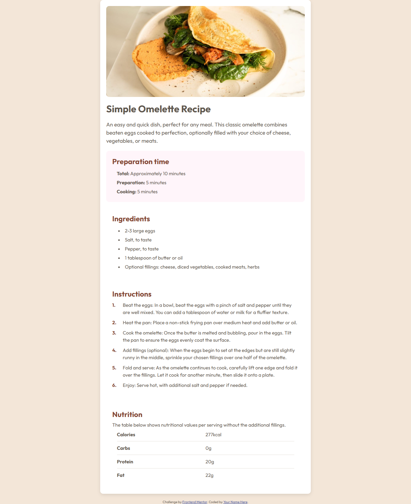
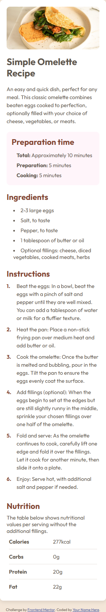

# Recipe Page

A responsive **recipe page** built with **HTML** and **CSS**, showcasing clean layout, typography, and spacing. The project focuses on semantic HTML, accessibility, and a user-friendly interface while following a consistent color palette and style guide.

## Features

- Fully responsive design for mobile and desktop
- Semantic HTML structure for better accessibility
- Clean and maintainable CSS, using reusable styles
- Organized layout with proper spacing and alignment
- Buttons and links styled consistently for a polished look

## Technologies Used

- HTML5
- CSS3 (Flexbox, responsive units)
- Google Fonts for typography

## Project Structure

## Screenshots

## Live Demo

You can view the live version of the project here:  
[https://HakimDev-tech.github.io/Recipe-Page/](https://HakimDev-tech.github.io/Recipe-Page/)

## What I Learned

- How to structure a page semantically for better accessibility
- Using Flexbox to create flexible and responsive layouts
- Managing spacing and alignment for a clean visual hierarchy
- Applying consistent styling for typography, buttons, and cards

## Possible Improvements

- Enhance accessibility further with ARIA attributes
- Refactor CSS for even more reusable components
- Add subtle animations for interactive elements

## Author

**HakimDev-tech** – [GitHub Profile](https://github.com/HakimDev-tech)
